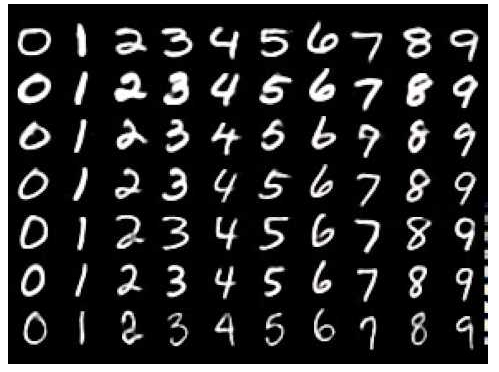

# MNIST Digit Recognizer

Over the break, I want to make a demo app for one of my Machine Learning project so I decided to start with MNIST, something classic that I have built quite few time. This is a classic MNIST problem, handwritten digit recognizer.  

I built my model architecture with 5 layers convolution neural network. I also implmeneted additional data generation using a image data geneartor from the Keras library and experimented with several data preprocessing methods, with 30 eproch, a final testing accuracy of 99.7% was acheived.

The most exciting part for me in this project is to write a website allow user to submit handwritten image and see the prediction. I used Tensorflow and also html, javascript, css to create my website. 

